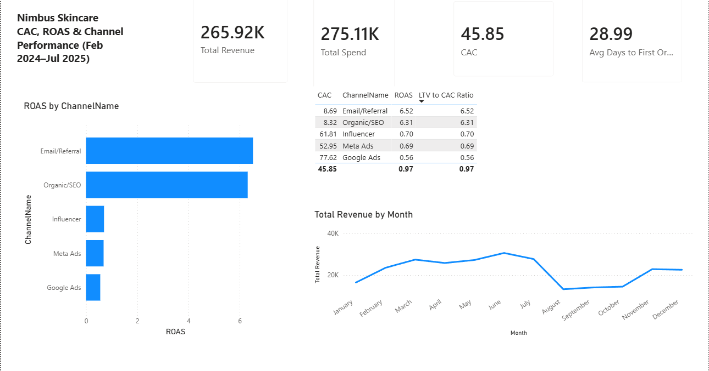

# Nimbus Skincare — Growth Analytics Portfolio

**One fictional D2C skincare brand. Three tools. One growth question answered three ways.**

Most portfolios show a random Power BI dashboard, an unrelated Tableau viz, and a generic ML model trained on a Kaggle dataset. This one doesn't. Every project here analyzes the same synthetic 18-month dataset for a fictional D2C brand, **Nimbus Skincare**, built from the ground up in Python to mirror real Shopify/D2C growth marketing data — because that's my actual background (2 years in Shopify growth marketing at Cartrabbit and CornerCart, working with 150+ B2B store owners).

The question across all three projects: **why are we losing customers, and what should we do about it?**

---

## The Findings

1. **Blended CAC is barely profitable (ROAS 0.97), but that number hides a 9x gap between channels.** Organic/SEO and Email/Referral return 6x+ on spend; Google Ads returns 0.56. → [Power BI dashboard](./01-powerbi-cac-dashboard)

2. **~81% of customers churn within 90 days, and retention collapses within the first 2–3 months for nearly every signup cohort** (95%+ month 0 → single digits by month 3). → [Tableau dashboard](./02-tableau-cohort-rfm)

3. **Engagement drop-off — not purchase history, demographics, or acquisition channel — is the single strongest predictor of churn.** A churn model (XGBoost, 0.95 ROC-AUC) with SHAP explainability shows *why* each customer is at risk, mapped to a specific retention action. → [Python/ML project](./03-ml-churn-shap)

---

## Projects

### 1. Power BI — CAC, ROAS & Channel Performance
`01-powerbi-cac-dashboard/nimbus_cac_roas_dashboard.pbix`



DAX measures for CAC, ROAS, and LTV by acquisition channel, plus a monthly revenue trend showing BFCM seasonality. Built on a proper star-schema-style model (bridge table + relationships) rather than flattening everything into one table.

*(Power BI Desktop files don't have a free public web-embed option like Tableau — the screenshot above shows the live dashboard; download the `.pbix` file to explore it interactively.)*

### 2. Tableau — Cohort Retention & RFM Segmentation
`02-tableau-cohort-rfm/Book1.twb`
**Live dashboard:** https://public.tableau.com/app/profile/aashika.joseph/viz/nimbus_tableau_cohort_rfm/Dashboard1

An 18-month cohort retention heatmap (% of each signup cohort still buying, month by month) and an RFM (Recency/Frequency/Monetary) scatter plot identifying best, at-risk, and lost customer segments.

### 3. Python — Churn Prediction + SHAP Explainability
`03-ml-churn-shap/churn_model.ipynb`

An XGBoost classifier (0.951 ROC-AUC) predicting 90-day churn, with SHAP values used two ways:
- **Globally** — which features actually drive churn across the whole customer base
- **Per customer** — for each at-risk customer, their top churn driver is mapped to a specific recommended action (e.g. "low engagement → re-engagement email," "low frequency → win-back discount"), turning a prediction into something a marketing team could act on the same day.

### 4. SQL — Sales & Channel Analysis
`04-sql-sales-analysis/`

*(In progress)* Raw SQL queries against the same Nimbus dataset — revenue trends, channel performance, and customer-level analysis — proving direct SQL fluency alongside the BI-tool and Python work above.

---

## The Data

`data/generate_dataset.py` generates the full synthetic dataset (customers, orders, campaigns, engagement events) from scratch — 6,000 customers, ~8,400 orders, 18 months, 5 acquisition channels with realistic CAC/quality tradeoffs, and built-in seasonality (BFCM spike, summer bump). Nothing here is downloaded from Kaggle; the pipeline is reproducible:

```bash
cd data
pip install faker pandas numpy
python generate_dataset.py
```

This regenerates `customers.csv`, `orders.csv`, `campaigns.csv`, and `events.csv`.

---

## About Me

I'm Aashika Joseph — a growth marketer transitioning into data/AI-ML roles, based in Chennai. Background in Shopify ecosystem growth marketing (Cartrabbit, CornerCart), LinkedIn community building, and B2B podcast hosting. This portfolio represents a deliberate pivot: using domain knowledge from real growth marketing work to build technically credible data projects, not generic tutorials.

- LinkedIn: [in/aashikajoseph](https://www.linkedin.com/in/aashikajoseph/)
- GitHub: [@aashika-sheik](https://github.com/aashika-sheik)
